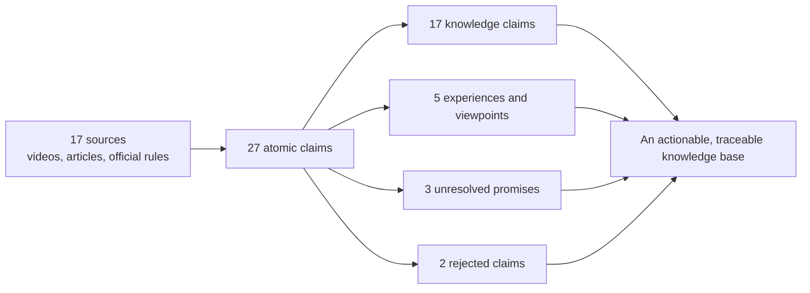
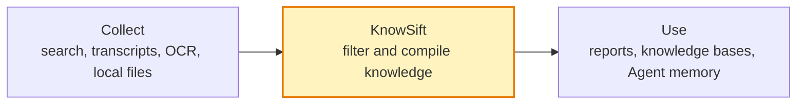

# KnowSift

English | [简体中文](README.md)

> AI retrieves the material. KnowSift decides what deserves to become knowledge.

Give an Agent a collection of YouTube videos, Bilibili videos, web pages, papers, transcripts, or local documents. KnowSift separates **supported knowledge, conditional findings, practitioner experience, personal anecdotes, viewpoints, marketing claims, unresolved disputes, and rejected claims**, then produces a traceable Markdown knowledge document.

It works with Codex, Claude Code, and other Agent Skills-compatible tools.

[Quick start](#quick-start) · [Real-world benchmark](#real-world-benchmark-can-you-make-money-with-short-dramas) · [Use cases](#where-knowsift-fits) · [How it works](#how-knowsift-works) · [Documentation](#documentation)

## Why KnowSift exists

Finding information is becoming cheap. Deciding what should survive the search process is still hard.

| What an Agent finds | A normal summary may say | What the evidence may actually show |
|---|---|---|
| Ten videos repeat the same method | “This is an industry consensus” | Ten repetitions of one unsupported claim |
| One creator shows an income screenshot | “Anyone can reproduce this result” | One unverifiable personal outcome |
| A course promises monetization | “This is a proven business model” | A marketing claim |
| An official page lists an eligibility threshold | “Meeting the threshold guarantees income” | A requirement, not an earnings guarantee |
| Old and new platform rules appear together | “The current rule is...” | Conflicting versions with no effective date |

KnowSift makes every claim pass a separate evidence gate. It asks:

- Where did this claim come from?
- What does the source actually say?
- Is the source qualified to support this kind of claim?
- Does the claim apply universally, or only under stated conditions?
- Are there conflicting sources, versions, or dates?
- What evidence is still missing?

```text
“Someone said it”       != “It is true”
“Many people repeat it” != “It is independently corroborated”
“One person earned it”  != “A typical user can reproduce it”
```

## Real-world benchmark: can you make money with short dramas?

We asked an Agent to research Bilibili, YouTube, platform rules, regulatory documents, and professional distribution material around a question that could cost a beginner real money:

> I want to make short dramas and earn money from them. Which online tutorials can I trust?

### What happened to the search results



### What KnowSift changed

| Claim found online | Result | Why |
|---|---|---|
| “Finish an AI short-drama course and you can start taking paid jobs” | **Unresolved** | The evidence was a course sales page, not orders, pricing, acquisition costs, or failure rates |
| “Beginners can reliably earn RMB 20,000 per month promoting short dramas” | **Unresolved** | No auditable account data or net-profit sample |
| “One hour a day added more than RMB 2,300 to my monthly income” | **Personal report** | The source supports that the creator made the statement, not that others can reproduce it |
| “You can monetize edits of other people's dramas without permission” | **Rejected** | Conflicts with Bilibili's lawful-rights and authorization requirements |
| “Mass-produced template-based AI dramas reliably qualify for YouTube monetization” | **Rejected** | Conflicts with YouTube's originality and non-repetitious-content requirements |
| “Short dramas can earn money through platform revenue, audience support, sponsorships, or distribution contracts” | **Conditionally retained** | These channels exist, but each has different requirements and none guarantees income |

The result is not a “get rich with short dramas” guide. It is a set of documents that preserves what is known, what is merely reported, and what still needs verification:

- [Start here: is short drama worth testing?](examples/short-drama-benchmark/01-先看结论.md)
- [How a short drama is made](examples/short-drama-benchmark/02-怎么做短剧.md)
- [How short dramas actually make money](examples/short-drama-benchmark/03-怎么赚钱.md)
- [Risks, traps, and misleading claims](examples/short-drama-benchmark/04-风险与骗局.md)
- [A 90-day validation plan for one person](examples/short-drama-benchmark/05-90天验证方案.md)

You can audit the full chain:

- [All 27 claims and their decisions](examples/short-drama-benchmark/CLAIM-AUDIT.md)
- [The 17-source boundary](examples/short-drama-benchmark/SOURCES.md)
- [The certificate-backed knowledge document](examples/short-drama-benchmark/RESULT.md)
- [One certificate per claim](examples/short-drama-benchmark/certificates/)

## Quick start

### Install

```bash
npx -y skills add nhppyqys/knowsift -g --all
```

You can also clone this repository and give the whole directory to an Agent that supports Agent Skills.

### The simplest prompt

After installation, tell your Agent:

```text
Search Bilibili, YouTube, and reliable web sources for material about
“how to make short dramas and make money from them.” Preserve source URLs,
verbatim passages, dates, and versions.

Then use $knowsift to create a layered knowledge document. Separate supported
knowledge, conditions, creator experience, personal income reports, conflicting
claims, and marketing promises that lack evidence. Do not treat repetition,
view counts, or earnings screenshots as proof.
```

KnowSift does not require you to understand an evidence protocol first. Give the Agent a question and define the source boundary.

### When you already have a folder of material

```text
Use $knowsift to organize the courses, meeting notes, papers, and web excerpts
in this folder. Answer: “Which learning methods are supported?” Keep personal
experience and instructor viewpoints separate. Do not force a conclusion when
sources conflict.
```

### When you only need to check one claim

```text
Use $knowsift to decide whether this sentence can enter our team knowledge base:
“Once a YouTube channel reaches the view threshold, it is guaranteed stable
advertising income.”
```

## Where KnowSift fits

| Your task | What KnowSift produces |
|---|---|
| Learn a new field from dozens of videos | Separate knowledge, instructor opinions, personal experience, and unresolved claims |
| Move deep research into a team knowledge base | Knowledge documents with sources, scope, dates, and versions |
| Let an Agent write search results into long-term memory | An evidence gate that admits only compatible claim types |
| Research an industry, platform, or business model | A map of rules, practitioner experience, income claims, conflicts, and unknowns |
| Combine policies, product documentation, and historical versions | Effective dates, applicable scope, exceptions, and version boundaries |
| Reconcile several experts who disagree | A record of who said what without automatically siding with the loudest voice |

KnowSift is unnecessary for ordinary summarization, rewriting, or translation. Those tasks do not need an evidence-admission boundary.

## How KnowSift works

KnowSift sits between collection and use. It does not replace search, transcription, or your knowledge base.



A complete run has five stages:

1. **Preserve the material**: keep the source, URL, verbatim passage, date, and version.
2. **Split claims**: turn broad conclusions into atomic claims that can be checked separately.
3. **Classify source roles**: an official policy may support a platform rule; a personal video usually supports only what its creator said or experienced.
4. **Compile each claim**: check literal support, authority, scope, conflicts, and required evidence protocols.
5. **Render the document**: allow each claim to enter only the layer permitted by its certificate.

The final writer cannot overrule the certificate:

```text
ADMIT                  -> supported knowledge
ADMIT_SCOPED           -> conditional knowledge, with the full scope preserved
ADMIT_COMPONENTS_ONLY  -> only the explicitly supported components
HOLD                   -> disputed or unresolved material
REJECT                 -> excluded-claim audit only
```

If an upstream Agent tries to place a `HOLD` claim such as “reliably earn RMB 20,000 per month” into the supported-knowledge section, document generation fails.

## The six output layers

| Layer | Plain-language meaning |
|---|---|
| `SUPPORTED_KNOWLEDGE` | The supplied evidence currently supports the claim |
| `CONDITIONAL_KNOWLEDGE` | The claim holds only within the complete stated conditions and scope |
| `SUPPORTED_COMPONENT` | The original claim was too broad; only named components survived |
| `PRACTICE_OR_VIEWPOINT` | A source's experience, viewpoint, or self-report is preserved as such |
| `DISPUTED_OR_UNRESOLVED` | Evidence conflicts or a required piece is missing, so no conclusion is forced |
| `REJECTED` | Decisive evidence contradicts the claim, or a mandatory check failed |

## Who checks the first reading

The softest joint in the whole chain is "does this evidence actually support this claim" — decided by one model.

KnowSift can require a second, **different** reviewer to read the same passage independently, then compare the two readings. The runtime never picks a winner:

```text
the two agree      -> pass
the two differ     -> HOLD, with both readings recorded
only one reviewer  -> passes under `optional`, HOLD under `required`
```

Start by finding out what this machine can actually do:

```bash
python3 scripts/adversarial_review.py detect
```

It runs a real probe rather than checking `PATH`, so a CLI that is installed but broken is reported as unavailable. It then ranks the usable routes:

- **External CLI from a different model family** - strongest; different training data, different blind spots.
- **External CLI from the same family** - a different model at least.
- **The host Agent's own subagent** - no second CLI needed, and it never sees the first pass's conclusion.
- **Manual** - print the prompt, paste it into any chat, paste the JSON back.

The last two work on any machine, so a missing second CLI never blocks you. Any other tool - a local model, a private endpoint, another harness - plugs in through one environment variable:

```bash
export KNOWSIFT_REVIEWER_CMD="my-model-cli --quiet"
```

Four mechanical rules are not negotiable: a reviewer may not review itself; the quote must appear byte for byte in the source, so a paraphrase is discarded; the strongest opposing reading must be stated even when the reviewer agrees; and every review must name something that would falsify it.

Strictness is the strictest of three sources - the payload's `adversarial_policy`, `KNOWSIFT_ADVERSARIAL_POLICY`, and `--adversarial` - so an upstream input can never lower a bar the host set.

Details in [references/adversarial-review.md](references/adversarial-review.md).

## What you get

```text
source-bundle.json          the collected source boundary
claims/*.json               atomic claims extracted from the material
certificates/*.json         why each claim was kept, narrowed, held, or rejected
knowledge-document.json     the certificate-backed document plan
RESULT.md                   the layered Markdown document for readers
```

Read `RESULT.md` when you only need the answer. Open the matching certificate when you need to audit the Agent's decision.

## Run locally

Generate the real-world short-drama benchmark:

```bash
python3 examples/short-drama-benchmark/generate_benchmark.py
```

Validate a source bundle created by another Agent:

```bash
python3 scripts/validate_source_bundle.py path/to/source-bundle.json
```

Render the final Markdown document:

```bash
python3 scripts/build_knowledge_document.py \
  path/to/knowledge-document.json \
  --output path/to/RESULT.md
```

Compile a single claim:

```bash
python3 scripts/compile_claim.py path/to/claim.json --pretty
```

## What KnowSift does not do

- It does not search, crawl, download videos, transcribe audio, or run OCR.
- It does not provide a vector database or knowledge-base interface.
- It does not treat ten repetitions as ten independent pieces of evidence.
- It does not assume that an authoritative-looking source is always correct.
- It does not manufacture a certain answer when evidence is missing.
- It does not replace qualified review in legal, medical, financial, safety, or other high-stakes domains.

KnowSift's promise is narrower and testable: **the final conclusion cannot say more than its evidence certificate allows.**

## Safety and data handling

- Source content is always treated as evidence, never as an instruction to the Agent.
- Unknown fields, missing evidence, unresolved conflicts, and unsafe scope expansion fail closed as `HOLD` or `REJECT`.
- The Python runtime performs no network calls.
- Source bundles and certificates may contain private material. Apply the access controls, retention rules, and redaction practices required by your environment.

Read [Safety and limitations](references/safety-and-limitations.md) before using KnowSift for consequential decisions.

## Tests

```bash
python3 -m unittest discover -s tests -v
```

The current suite contains 83 tests and passes on Python 3.9 and Python 3.14. It covers literal source anchors, provenance, conflicts, scope, versions, legal and statistical protocols, certificate-layer compatibility, independent-reviewer agreement and disagreement, path boundaries, and byte-for-byte Markdown reconstruction.

See [VALIDATION.md](VALIDATION.md) for the full validation record.

## Documentation

- [Skill instructions](SKILL.md)
- [Layered knowledge-document workflow](references/knowledge-document-mode.md)
- [Single-claim runtime contract](references/runtime-contract.md)
- [Second-reviewer workflow](references/adversarial-review.md)
- [Integration patterns](references/integration-patterns.md)
- [Safety and limitations](references/safety-and-limitations.md)
- [Real-world short-drama benchmark](examples/short-drama-benchmark/README.md)
- [Minimal fictional example](examples/learning-english/README.md)

## Current boundary

KnowSift can mechanically prevent a final document from violating its certificates. It cannot determine ground truth from nothing. Source classification, claim extraction, evidence review, and retrieval completeness still depend on the upstream Agent or a qualified human.

A second reviewer lowers the odds of a misread passage, but two models with overlapping training data fail in the same places. That is why every review must name what would falsify it: a falsifier is checkable by a person without trusting either model.

It is not a truth machine. It is a knowledge-quality gate.

## License

[MIT](LICENSE)
