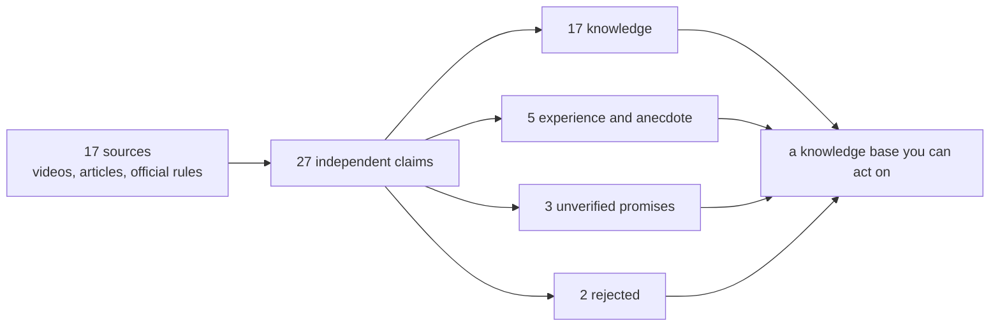

# KnowSift

English | [简体中文](README.md)

> Of everything you just retrieved, what can you actually use?

Hand videos, articles, papers, official documentation, courses, and local notes to your Agent. KnowSift separates the **knowledge, conditional findings, practitioner experience, personal anecdotes, marketing promises, and plain errors** that arrive mixed together, labels each one with what it is actually worth, and produces a knowledge document you can trace back to the source text.

Works with Claude Code, Codex, and other tools that support Agent Skills.

[Quick start](#quick-start) · [What it does for your role](#what-it-does-for-your-role) · [Real benchmark](#real-benchmark-how-do-you-actually-make-money-from-short-dramas) · [Three ways to use it](#three-ways-to-use-it) · [Docs](#documentation)

## What actually changes

The same pile of material, summarised normally versus compiled by KnowSift:

| What the material contains | A normal summary says | KnowSift says |
|---|---|---|
| Ten videos describing one method | "the industry-standard method" | ten retellings, possibly of one upstream source |
| A creator posting income screenshots | "anyone can replicate this" | one person's account, not verifiable |
| A course page promising results | "the complete path to income" | a marketing promise, unverified |
| An official page listing a threshold | "hit the threshold and you earn" | an eligibility condition, not a revenue guarantee |
| Old and new rules appearing together | "the current rule is…" | both, with versions and effective dates |

**It is not there to filter out the fakes. It is there to put the right price tag on every piece.** You still read everything — you just know which line is written into platform policy, which line is one person's luck, and which line is someone selling you a course.

## What it does for your role

### Learning a new field from scratch

You have forty bookmarked videos and a dozen articles, and the more you read the less certain you are. Everyone contradicts everyone, and everyone sounds reasonable.

**You get** a layered study document: real methodology, findings that hold only under stated conditions, an instructor's personal style, and claims nobody has ever demonstrated — each in its own section. Plus a list of the specific evidence still missing, so you know what to go and check next.

```text
Search YouTube, the web, and reliable sources for content about XXX, keeping
source links, original text, dates, and versions. Then use $knowsift to build a
knowledge document: separate supported knowledge, conditions, creator experience,
personal income claims, conflicting statements, and unverified promises.
Do not treat repetition, view counts, or income screenshots as proof.
```

### E-commerce, ads, and platform operations

Platform rules change every quarter, tutorials are everywhere, and you need to tell the threshold an official page states from the folklore an agency repeats. Getting it wrong costs money and sometimes the account.

**You get** official rules in their own section with effective dates, versions, scope, and exceptions; practitioner experience in its own section, labelled with who achieved it under what conditions; and conflicting claims shown side by side rather than resolved for you. When a rule changes, only the affected entries need rechecking.

```text
Use $knowsift on this material to answer "what are the current rules for
<platform> <category>". Keep official documentation, agency tutorials, and
merchant accounts separate. Tag every rule with its effective date and version,
and when old and new rules conflict, keep both and say so.
```

### Content creators and publishers

You are about to cite a statistic, a policy, or a case study on camera. Get it wrong once and the comments will not let it go.

**You get** every quotable line carrying its source text and link, ready to drop into a footnote; anything shakier held back in "unverified" so it cannot slip into your script as fact; and a record of what was excluded, so you can explain why you did not repeat the popular claim.

```text
Use $knowsift to check which claims in this material I can state on camera.
For the ones I can, give me the source text and link. For the ones I cannot,
tell me exactly what evidence is missing.
```

### Investment research and due diligence

In front of you: a prospectus, audited statements, a pitch deck, industry newsletters, and expert-call notes, all mixed together.

**You get** audited data, regulatory filings, company statements, sell-side opinion, and market chatter kept apart. Historical performance and forward expectations run through different evidence standards — the first needs audited data, the second needs a model with stated assumptions. A past average never quietly becomes an expected return.

```text
Use $knowsift on this material to answer "which conclusions about this company
or sector have hard evidence". Keep audited and regulatory sources separate from
company statements and sell-side views. Treat historical performance and forward
expectations separately, and require stated assumptions for any expectation.
```

### Legal, compliance, and policy research

On one question, the statute, the regulation, the local implementing rule, an official FAQ, and a law-firm note may all say different things, each with its own effective date.

**You get** sources ordered by authority, each carrying jurisdiction, effective date, version, and exceptions. Where a lower rule conflicts with a higher one, the conflict is recorded rather than smoothed over. A law-firm blog post never gets treated as the statute.

```text
Use $knowsift on these documents to answer "what is the current rule for X in Y".
Order sources by authority and tag jurisdiction, effective date, and exceptions.
Where a subordinate rule conflicts with a superior one, state the conflict rather
than reconciling it for me.
```

### Internal knowledge bases and enablement

Three years of meeting notes, documents from people who have left, purchased courses, and vendor white papers sitting in a shared drive. You want something a new hire can actually rely on.

**You get** a document fit to enter the knowledge base, every entry carrying its source and scope. Internal experience keeps its identity as "how we do it" instead of being written up as industry practice, and stale material surfaces because its version no longer matches.

```text
Use $knowsift on this folder of notes, documents, courses, and external material
to answer "what have we actually settled on for X". Keep internal practice
separate from general industry practice, and list anything stale or
version-conflicting on its own.
```

### AI product and Agent developers

Your Agent writes search results into long-term memory. One wrong memory poisons every later answer, and it is very hard to notice.

**You get** an admission gate you can put in front of the write. Only certified content enters memory; `HOLD` goes back for more evidence; `REJECT` is kept as conflict history. When a source changes, a reverse index tells you exactly which entries to recompile. The whole process is auditable, reproducible, and deterministic down to the byte.

```text
Before writing this into long-term memory, compile it against its source with
$knowsift. Anything that does not come back ADMIT must not be stored as fact.
```

### Consultants and researchers

Your deliverable has to survive a client asking, line by line, "where did you get that?"

**You get** a readable conclusions document plus a complete audit table: why every claim was kept, narrowed, held, or excluded. The client can open any line they want.

```text
Use $knowsift to produce the deliverable and keep every claim's certificate and
source list. The conclusions document is for reading; the audit table is for
checking.
```

## Real benchmark: how do you actually make money from short dramas?

We pointed an Agent at Bilibili, YouTube, platform rules, regulator documents, and professional distribution pages, to answer a question people really do spend money getting wrong.



| A claim found online | Compiled result | Why |
|---|---|---|
| "Finish the AI short-drama course and you can take orders" | **Unverified** | only a course sales page: no orders, rates, acquisition cost, or failure rate |
| "Beginners reliably earn 20k/month promoting short dramas" | **Unverified** | no auditable dashboard, no net-profit sample |
| "One hour a day, 2300+ extra this month" | **Personal account** | confirms the poster said it, not that others can repeat it |
| "You can monetise other people's dramas without a licence" | **Rejected** | conflicts with Bilibili's rights and full-authorisation requirement |
| "Mass-produced templated AI dramas reliably monetise on YouTube" | **Rejected** | conflicts with YouTube's originality and non-repetitious content rules |
| "Short dramas earn via platform revenue, tips, brand deals, or distribution" | **Conditional** | the channels are real, each has different thresholds, none guarantees income |

The result is not a get-rich guide. It is five documents you can act on:

- [Is it worth doing at all](examples/short-drama-benchmark/01-先看结论.md)
- [How to actually make one](examples/short-drama-benchmark/02-怎么做短剧.md)
- [Where the money really comes from](examples/short-drama-benchmark/03-怎么赚钱.md)
- [The traps and the scams](examples/short-drama-benchmark/04-风险与骗局.md)
- [A 90-day validation plan for one person](examples/short-drama-benchmark/05-90天验证方案.md)

To check whether the filtering was honest: [full audit of 27 claims](examples/short-drama-benchmark/CLAIM-AUDIT.md) · [17 sources](examples/short-drama-benchmark/SOURCES.md) · [per-claim certificates](examples/short-drama-benchmark/certificates/)

## A second benchmark: what the AI field says about itself

We compiled 17 widely repeated prompting and retrieval claims against the verbatim abstracts of 9 papers and 2 pages of official platform documentation.

**Result: only 7 survive as usable knowledge. 6 are contradicted outright, 4 are unresolved.**

| A claim you have probably seen | What the original source actually says |
|---|---|
| Chain-of-thought improves performance broadly | A meta-analysis of 100+ papers: gains are **primarily** on math and logic, much smaller elsewhere |
| RAG eliminates hallucination | When retrieved content is wrong, models override their own correct answer **over 60%** of the time |
| Prompt caching saves money | Official pricing: a cache **write** costs **1.25x** base input — unused, it is a net loss |
| Letting a model check its own work always helps | **Two papers give opposite evidence**; the tool does not pick a side |

We ran the gate on ourselves too. The first reading came from claude-opus-5; claude-haiku-4-5 then read the same source text in a fresh context, never told the first conclusion. They disagreed on 4 of 18 evidence relations — **all four on claims containing a universal quantifier**, both models giving the same reason: the evidence tests a handful of specific models and cannot support "for any model". Those three claims dropped from conditional knowledge to unresolved.

Every word the second reviewer wrote is in the repository for you to check.

[Full case and all certificates](examples/ai-folklore-benchmark/README.md)

## Quick start

```bash
npx -y skills add nhppyqys/knowsift -g --all
```

Or clone the repository and hand the whole directory to any Skills-capable Agent.

You do not need to understand the evidence protocol first. Give it a question and the material it may use.

## Three ways to use it

**Research a topic from nothing** — let the Agent search, then compile:

```text
Search Bilibili, YouTube, and reliable pages for how to make short dramas and
how people earn from them, keeping links, original text, dates, and versions.
Then use $knowsift to build a knowledge document.
```

**You already have the files**:

```text
Use $knowsift on the courses, meeting notes, papers, and web excerpts in this
folder to answer "which study methods are actually supported". List personal
experience and instructor opinion separately, and do not pick a side for me
when sources conflict.
```

**You just want one sentence checked**:

```text
Use $knowsift to check whether this belongs in the team knowledge base:
"Once a channel passes YouTube's view threshold, stable ad revenue follows."
```

## The six output layers

| Layer | In plain terms |
|---|---|
| `SUPPORTED_KNOWLEDGE` | current evidence supports it; usable as knowledge |
| `CONDITIONAL_KNOWLEDGE` | holds only within the stated conditions and scope |
| `SUPPORTED_COMPONENT` | the original claim was too broad; only the supported part survives |
| `PRACTICE_OR_VIEWPOINT` | confirms someone's experience, view, or account |
| `DISPUTED_OR_UNRESOLVED` | conflicting or missing key evidence; no conclusion yet |
| `REJECTED` | contradicted by decisive evidence, or failed a required check |

The load-bearing rule: **the final writer cannot go past the certificate.** Even if an upstream Agent wants to put an unverified "20k a month" claim into the knowledge section, document generation fails.

## What you get

```text
source-bundle.json          what material was collected
claims/*.json               what claims were extracted from it
certificates/*.json         why each claim was kept, narrowed, held, or excluded
RESULT.md                   the layered knowledge document, for humans
```

Just want the answer? Read `RESULT.md`. Want to audit the Agent's judgement? Open the certificate.

## Want it stricter? Three gates you can switch on

The defaults are fine for most work. When the stakes are higher, turn them up one at a time.

**Have a second model review the reading independently.** It runs in a fresh context that is never shown the first conclusion, and holds the claim when the two disagree. It first detects what your machine can actually do — another vendor's CLI, the host Agent's own subagent, or simply printing the prompt for you to paste anywhere. **One model installed is enough.**

```bash
python3 scripts/adversarial_review.py detect
```

**Make the source address prove its own role.** Add a URL to each piece of evidence and the runtime checks whether that address can legitimately play the role it claims — a platform's rules page may be official documentation; a video uploaded by an account on the same site may not. This closes the "an upstream Agent labelled a sales page as official documentation" problem.

**Make quotes trace back to the capture.** Add the hash of the captured file and the runtime confirms the quoted sentence appears byte for byte in the bytes you actually captured, rather than in somebody's paraphrase.

```bash
python3 scripts/compile_claim.py claim.json \
  --adversarial required --locator required --snapshot required --snapshot-root ./captures
```

All three can be switched on organisation-wide through environment variables, and an upstream input cannot turn them back down.

## When not to use it

Skip it for ordinary summarising, rewriting, or translation. That work does not need an evidence gate and this will only slow it down.

Skip it for mathematical proof, aesthetic judgement, and your own first-hand experience: the first has its own form of checking, and for the last you are the primary source.

It does not search, crawl, download video, transcribe, or run OCR, and it is not a vector database or a knowledge-base UI. Those stay with the tools you already use; this owns the gate in between.

In high-stakes domains — medical, legal, financial, safety — it will organise the evidence properly, but it does not replace qualified review.

## Tests

```bash
python3 -m unittest discover -s tests -v
```

119 tests pass on both Python 3.9 and 3.14, covering literal source anchors, conflicts, scope, versions, legal and statistical protocols, certificate-layer compatibility, independent-reviewer agreement and disagreement, locator and snapshot verification, path boundaries, and byte-for-byte Markdown reconstruction. Full record in [VALIDATION.md](VALIDATION.md).

## Documentation

- [Skill instructions](SKILL.md)
- [Layered knowledge-document workflow](references/knowledge-document-mode.md)
- [Single-claim runtime contract](references/runtime-contract.md)
- [Second-reviewer workflow](references/adversarial-review.md)
- [Locator and snapshot gates](references/source-provenance.md)
- [Integration patterns](references/integration-patterns.md)
- [Safety and limitations](references/safety-and-limitations.md)
- [Real-world short-drama benchmark](examples/short-drama-benchmark/README.md)
- [AI folklore audit](examples/ai-folklore-benchmark/README.md)
- [Minimal fictional example](examples/learning-english/README.md)

## License

[MIT](LICENSE)
