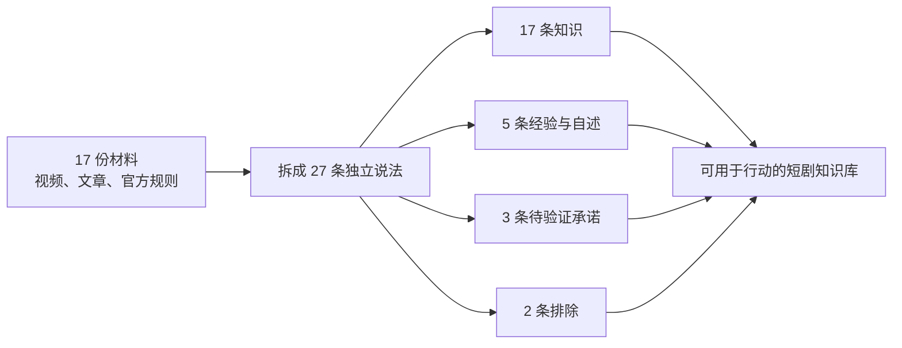
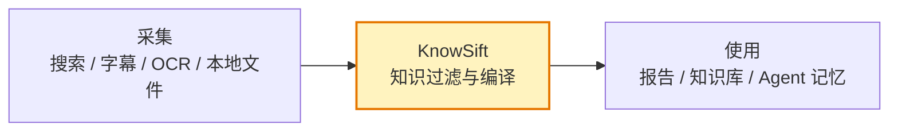

# KnowSift

[English](README.en.md) | 简体中文

> AI 负责把资料找回来，KnowSift 负责决定什么配叫知识。

把 Bilibili、YouTube、网页、论文和本地文档交给 Agent。KnowSift 会把混在一起的**知识、条件结论、从业者经验、个人自述、营销承诺和错误说法**分开，生成一份可以追溯来源的 Markdown 知识文档。

适用于 Codex、Claude Code，以及其他支持 Agent Skills 的工具。

[快速开始](#快速开始) · [真实案例](#真实案例做短剧怎么赚钱) · [适用场景](#knowsift-适合用在哪里) · [工作原理](#knowsift-怎样工作) · [完整文档](#文档)

## 为什么需要 KnowSift

搜索已经不难了。真正困难的是搜索之后：

| Agent 找到的内容 | 普通总结容易写成 | 实际上可能只是 |
|---|---|---|
| 十个视频都在讲同一个方法 | “行业公认的方法” | 十次重复转述 |
| 一位创作者晒出收入 | “普通人可以复制” | 一个无法核验的个案 |
| 课程页面承诺学完变现 | “完整赚钱路径” | 营销承诺 |
| 官方页面写明平台门槛 | “满足门槛就能赚钱” | 申请条件，不是收入保证 |
| 新旧规则同时出现 | “当前规定是……” | 没有区分版本和生效日期 |

KnowSift 给每条说法单独过一道门：它来自哪里、原文到底说了什么、支持范围有多大、是否存在冲突、还缺什么证据。

```text
“有人这样说”    ≠   “这件事是真的”
“很多人都这样说” ≠   “已有独立证据证明”
“某个人赚到了”   ≠   “普通人照做也能赚到”
```

## 真实案例：做短剧，怎么赚钱？

我们让 Agent 检索 Bilibili、YouTube、平台规则、监管文件和专业发行页面，回答一个普通人真的会拿钱试错的问题：

> 我想做短剧，也想靠它赚钱。网上这么多教程，哪些能信？

### 搜索结果经过了什么



### KnowSift 改变了什么

| 网上找到的说法 | 编译结果 | 原因 |
|---|---|---|
| “学完 AI 短剧教程即可接单” | **待验证** | 只有课程营销页，没有订单、报价、获客成本和失败率 |
| “新手做短剧推广稳定月入 2 万” | **待验证** | 没有可审计后台和净利润样本 |
| “每天一小时，当月多赚 2300+” | **个人自述** | 可以确认发布者这样说过，不能推导普通人也能做到 |
| “不用授权也能剪别人的短剧赚钱” | **排除** | 与 B站的合法权利和完整授权要求冲突 |
| “批量生成模板化 AI 短剧可以稳定通过 YouTube 变现” | **排除** | 与 YouTube 的原创、非批量重复内容要求冲突 |
| “短剧可以通过平台收入、观众支持、商单或发行合同赚钱” | **有条件保留** | 收入渠道真实存在，但每条路都有不同门槛，均不保证收益 |

最终得到的不是“短剧暴富攻略”，而是五篇可以行动的知识文档：

- [先看结论：短剧值不值得做](examples/short-drama-benchmark/01-先看结论.md)
- [怎么做出一部短剧](examples/short-drama-benchmark/02-怎么做短剧.md)
- [短剧到底靠什么赚钱](examples/short-drama-benchmark/03-怎么赚钱.md)
- [最容易踩的坑和骗局](examples/short-drama-benchmark/04-风险与骗局.md)
- [一个人也能执行的 90 天验证方案](examples/short-drama-benchmark/05-90天验证方案.md)

想检查筛选是否诚实，可以继续查看：

- [27 条说法完整审计表](examples/short-drama-benchmark/CLAIM-AUDIT.md)
- [17 份来源清单](examples/short-drama-benchmark/SOURCES.md)
- [证书生成的分层知识文档](examples/short-drama-benchmark/RESULT.md)
- [每条说法的证书](examples/short-drama-benchmark/certificates/)

## 快速开始

### 安装

```bash
npx -y skills add nhppyqys/knowsift -g --all
```

也可以克隆仓库后，把整个目录交给支持 Skills 的 Agent。

### 最简单的用法

安装后，直接对 Agent 说：

```text
去 B站、YouTube 和可靠网页找关于“怎么做短剧、怎么通过短剧赚钱”的内容，
保留来源链接、原文、时间和版本。

然后使用 $knowsift 生成知识文档：
分开有证据支持的知识、适用条件、创作者经验、个人收入自述、
相互冲突的说法和证据不足的营销承诺。
不要把重复次数、播放量或收益截图当成真实性证明。
```

KnowSift 不要求你先理解证据协议。你只需要给出问题和允许 Agent 使用的资料范围。

### 已经有一批文件时

```text
使用 $knowsift 整理这个文件夹里的课程、会议记录、论文和网页摘录。
回答“哪些学习方法已经得到支持”。
个人经验和讲师观点单独列出；发现冲突时不要替我强行选边。
```

### 只想核验一句话时

```text
使用 $knowsift 检查这句话能不能进入团队知识库：
“达到 YouTube 的播放门槛后，频道一定能获得稳定广告收入。”
```

## KnowSift 适合用在哪里

| 你的真实任务 | KnowSift 的产出 |
|---|---|
| 看完几十个视频，想学习一个新领域 | 分开的知识、讲师观点、个人经验和待验证说法 |
| 深度研究结果准备进入团队知识库 | 带来源、范围和版本的知识文档 |
| Agent 准备把搜索结果写进长期记忆 | 只允许通过证据门槛的内容进入记忆 |
| 研究一个行业、平台或商业模式 | 规则、从业者经验、收入主张和未知问题地图 |
| 汇总政策、产品文档和历史版本 | 保留生效日期、版本、适用范围和例外 |
| 多位专家对同一问题意见冲突 | 记录谁说了什么，不把声量最大的人自动判为正确 |

不适合只需要普通摘要、改写或翻译的任务。那类工作不需要证据准入门。

## KnowSift 怎样工作

KnowSift 位于“采集”和“使用”之间。它不重新发明搜索，也不重新发明知识库。



一次完整处理包含五步：

1. **保留原材料**：来源、链接、原文、时间、版本不丢失；
2. **拆开说法**：一句大结论拆成可以分别检查的小结论；
3. **判断来源角色**：官方规则可以证明平台规则，个人视频通常只能证明发布者说过什么；
4. **逐条编译**：检查原文是否真的支持、范围是否扩大、是否存在冲突；
5. **生成文档**：每条内容只能进入与证书相符的章节。

关键限制是：最终写作者不能越过证书。

```text
证书是 ADMIT   → 可以进入知识
证书是 HOLD    → 只能进入待验证
证书是 REJECT  → 只能进入排除记录
```

即使上游 Agent 想把一个“月入两万”的 `HOLD` 说法写进知识章节，文档生成也会失败。

## 输出的六个层级

| 层级 | 用人话解释 |
|---|---|
| `SUPPORTED_KNOWLEDGE` | 当前证据支持，可以作为知识使用 |
| `CONDITIONAL_KNOWLEDGE` | 只在写明的条件和范围内成立 |
| `SUPPORTED_COMPONENT` | 原说法太大，只保留被证据支持的部分 |
| `PRACTICE_OR_VIEWPOINT` | 可以确认某人的经验、观点或自述 |
| `DISPUTED_OR_UNRESOLVED` | 有冲突或缺少关键证据，暂时不下结论 |
| `REJECTED` | 被决定性证据否定，或没有通过必要检查 |

## 谁来复核第一遍判断

整条链路上最软的一环，是「这句证据到底支不支持这个结论」——它由一个模型说了算。

KnowSift 可以要求第二个**不同的**审阅者独立读一遍同一段原文，然后比对两次判断。运行时不裁决谁对：

```text
两边一致       → 放行
两边不一致     → HOLD，两种读法都记录下来
只有一个审阅者 → optional 下放行，required 下 HOLD
```

先看这台机器实际能用什么：

```bash
python3 scripts/adversarial_review.py detect
```

它会真的跑一遍探测，而不是看命令在不在 PATH 上——装了但跑不起来的 CLI 会被如实报成不可用。然后给出可用路线，从强到弱：

- **外部 CLI，不同模型家族**（最强：训练数据不同，盲区也不同）
- **外部 CLI，同家族不同模型**
- **宿主 Agent 自己的 subagent**（不需要装第二个 CLI，副本看不到第一遍的结论）
- **手动**：打印提示词，粘到任何一个聊天窗口，把 JSON 粘回来

后两条在任何机器上都成立，所以「没装第二个 CLI」从来不是障碍。别的工具——本地模型、私有端点、另一个 Harness——设一个环境变量就能接进来：

```bash
export KNOWSIFT_REVIEWER_CMD="my-model-cli --quiet"
```

四条机械约束不讲情面：审阅者不能自己复核自己；引文必须逐字出现在原文里，改写一个字就作废；即使同意也必须写出最强的另一种读法；必须写出什么东西能推翻自己。

严格程度取三者中最严的一个：payload 里的 `adversarial_policy`、环境变量 `KNOWSIFT_ADVERSARIAL_POLICY`、命令行 `--adversarial`。上游 Agent 提交的输入永远调不低宿主设定的门槛。

细节见 [references/adversarial-review.md](references/adversarial-review.md)。

## 你会得到什么

```text
source-bundle.json          收集了哪些材料
claims/*.json               从材料中拆出了哪些说法
certificates/*.json         每条说法为什么保留、缩小、暂缓或排除
knowledge-document.json     最终文档的结构计划
RESULT.md                   给人阅读的分层知识文档
```

如果你只想阅读结果，看 `RESULT.md`。如果你要审计 Agent 的判断，打开对应的 certificate。

## 在本地运行

运行真实短剧案例：

```bash
python3 examples/short-drama-benchmark/generate_benchmark.py
```

验证外部 Agent 交来的来源包：

```bash
python3 scripts/validate_source_bundle.py path/to/source-bundle.json
```

生成最终 Markdown：

```bash
python3 scripts/build_knowledge_document.py \
  path/to/knowledge-document.json \
  --output path/to/RESULT.md
```

核验单条说法：

```bash
python3 scripts/compile_claim.py path/to/claim.json --pretty
```

## 它不做什么

- 不负责搜索、爬虫、视频下载、字幕或 OCR；
- 不提供向量数据库和知识库界面；
- 不把“十个人都说过”当作十份独立证据；
- 不因为来源看起来权威，就假设来源内容永远正确；
- 不在没有证据时制造一个确定答案；
- 不替代法律、医疗、财务等高风险领域的专业复核。

KnowSift 能保证的是：**证据支持到哪里，最后的结论就只写到哪里。**

## 测试

```bash
python3 -m unittest discover -s tests -v
```

当前 83 项测试同时通过 Python 3.9 与 Python 3.14，覆盖来源锚点、冲突、范围、版本、法律与统计协议、证书层级兼容、独立复核的一致与分歧、路径边界和最终 Markdown 的逐字节重建。

完整结果见 [VALIDATION.md](VALIDATION.md)。

## 文档

- [Skill 使用说明](SKILL.md)
- [分层知识文档工作流](references/knowledge-document-mode.md)
- [单条说法输入契约](references/runtime-contract.md)
- [第二审阅者工作流](references/adversarial-review.md)
- [产品接入方式](references/integration-patterns.md)
- [安全边界](references/safety-and-limitations.md)
- [真实短剧标杆案例](examples/short-drama-benchmark/README.md)
- [最小虚构演示](examples/learning-english/README.md)

## 当前边界

KnowSift 可以机械保证最终文档不违反证书，但不能凭空判断世界真相。来源分类、说法拆分和证据关系仍需要宿主 Agent 或人工正确完成。第二审阅者能降低证据关系判错的概率，但两个训练数据重叠的模型会在同一些地方一起犯错——所以每条复核都必须写下「什么能推翻我」，那一项是人可以自己去查的。

它不是“真理机器”。它是一道知识质量门。

## 许可证

[MIT](LICENSE)
