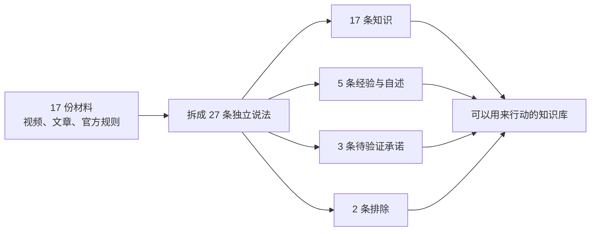

# KnowSift

[English](README.en.md) | 简体中文

> 你搜回来的东西里，哪些真能拿来用？

把视频、文章、论文、官方文档、课程和本地笔记交给 Agent。KnowSift 把混在一起的**知识、适用条件、从业者经验、个人自述、营销承诺和错误说法**分开，给每一条标上它真正的分量，生成一份能一路追回原文的知识文档。

适用于 Claude Code、Codex，以及其他支持 Agent Skills 的工具。

[快速开始](#快速开始) · [你是谁，它帮你做什么](#你是谁它帮你做什么) · [真实案例](#真实案例做短剧到底怎么赚钱) · [三种用法](#三种用法) · [文档](#文档)

## 它到底改变了什么

同一批材料，普通总结和 KnowSift 的差别：

| 材料里有什么 | 普通总结写成 | KnowSift 写成 |
|---|---|---|
| 十个视频讲同一个方法 | “行业公认的方法” | 十次转述，可能来自同一个上游 |
| 一位创作者晒收入截图 | “普通人可以复制” | 某人的自述，无法核验 |
| 课程页承诺学完变现 | “完整赚钱路径” | 营销承诺，待验证 |
| 官方页写明平台门槛 | “满足门槛就能赚钱” | 申请条件，不是收入保证 |
| 新旧规则同时出现 | “当前规定是……” | 分别标注版本与生效日期 |

**它不是帮你筛掉假的，是帮你给每条知识贴上正确的价签。** 你还是全都看，但你清楚哪条是官方写死的、哪条是某个人的运气、哪条背后有人想卖你课。

## 你是谁，它帮你做什么

### 想系统学一个新领域

你收藏了几十个视频、十几篇文章，越看越乱：每个人说的都不一样，每个人听起来都有道理。

**你会拿到**：一份分层的学习文档。哪些是真正的方法论、哪些只在特定条件下成立、哪些是讲师个人风格、哪些是没人证明过的说法，各归各位。附一张“还缺什么证据”的清单，告诉你下一步该去查什么。

```text
去 B站、YouTube 和可靠网页找关于「XXX」的内容，保留来源链接、原文、时间和版本。
然后用 $knowsift 生成知识文档：分开有证据支持的知识、适用条件、
创作者经验、个人自述、相互冲突的说法和证据不足的承诺。
不要把重复次数、播放量或收益截图当成真实性证明。
```

### 电商 / 投放 / 平台运营

平台规则三个月一变，教程满天飞，你需要分清「官方白纸黑字写的门槛」和「某个代运营说的玄学」。踩错一条，钱和号一起没。

**你会拿到**：官方规则单独成章，带生效日期、版本、适用范围和例外；从业者经验单独成章，标明是谁在什么条件下做到的；相互冲突的说法并列展示，不替你选边。规则一变，只有受影响的条目需要重新核。

```text
用 $knowsift 整理这些资料，回答「XX 平台 XX 类目现在的规则到底是什么」。
平台官方文档、代运营教程、商家自述分开列。
每条规则标注生效日期和版本；有新旧冲突时两条都保留并说明。
```

### 内容创作者 / 自媒体

你要在视频或文章里引用数据、政策、案例。引错一次，评论区能骂三天。

**你会拿到**：每句可引用的话都带原文出处和链接，能直接放进脚注；不够扎实的说法被拦在「待验证」里，不会不小心被你说成事实；被排除的说法留有记录，方便你解释「为什么我没采用那个流行说法」。

```text
用 $knowsift 核一下这批素材里哪些说法可以直接在视频里讲。
能讲的给我原文和链接，不能讲的告诉我缺什么证据。
```

### 投研 / 尽调 / 行业研究

你面前是招股书、审计报告、路演材料、行业公众号和调研纪要，全都混在一起。

**你会拿到**：审计数据、监管备案、公司自述、卖方观点、坊间传闻分开陈列。历史业绩和未来预期走不同的证据标准——前者要审计数据，后者要写明假设的模型。任何“过往平均收益”都不会被自动写成“预期收益”。

```text
用 $knowsift 整理这批材料，回答「这家公司/这个赛道的哪些结论有硬证据」。
审计与监管来源、公司自述、卖方观点分开。
历史业绩和未来预期分开处理，预期必须写明假设。
```

### 法务 / 合规 / 政策研究

同一件事，法条、部门规章、地方细则、官方问答、律所解读可能各说各话，还各有生效时间。

**你会拿到**：按效力层级排列的来源，每条带管辖范围、生效日期、版本和例外。下位规则和上位规则冲突时如实标出，不做调和。律所博客不会被当成法条。

```text
用 $knowsift 整理这些文件，回答「XX 在 XX 地现在到底怎么规定」。
按效力层级排列，标注管辖范围、生效日期和例外。
发现下位与上位规则冲突时，把冲突写出来，不要替我调和。
```

### 企业知识库 / 培训负责人

三年的会议纪要、离职同事的文档、外部课程、供应商白皮书堆在网盘里。你想沉淀出一套新人能直接用的东西。

**你会拿到**：一份可以进知识库的正式文档，每条都带来源和适用范围；内部经验保留“这是我们的做法”的身份，不会被写成行业通例；过期的内容因为版本对不上被挑出来。

```text
用 $knowsift 整理这个文件夹里的纪要、文档、课程和外部资料，
回答「我们在 XX 上已经确定的做法是什么」。
内部经验和外部通行做法分开；过期或版本冲突的单独列出。
```

### AI 产品 / Agent 开发者

你的 Agent 会把搜索结果写进长期记忆。一条错的记忆会污染后面所有回答，而且很难发现。

**你会拿到**：一道可以卡在写入之前的准入门。只有拿到证书的内容能进记忆，`HOLD` 的退回去补证据，`REJECT` 的留作冲突记录。源文件一变，反查出受影响的条目重新编译。整个过程可审计、可复现、字节级确定。

```text
在把这条内容写进长期记忆之前，用 $knowsift 对着它的来源编译一遍。
没有拿到 ADMIT 的，不许写成事实。
```

### 咨询顾问 / 研究员

交付物要经得起客户逐条追问：“这句话你从哪儿看来的？”

**你会拿到**：一份读者友好的结论文档，外加一份完整审计表——每条说法为什么保留、为什么缩小范围、为什么暂缓、为什么排除，全都留痕。客户想查哪条就翻哪条。

```text
用 $knowsift 生成交付文档，同时保留每条说法的证书和来源清单。
结论文档给人读，审计表给人查。
```

## 真实案例：做短剧，到底怎么赚钱？

我们让 Agent 检索 B站、YouTube、平台规则、监管文件和专业发行页面，回答一个普通人真的会拿钱试错的问题。



| 网上找到的说法 | 编译结果 | 原因 |
|---|---|---|
| “学完 AI 短剧教程即可接单” | **待验证** | 只有课程营销页，没有订单、报价、获客成本和失败率 |
| “新手做短剧推广稳定月入 2 万” | **待验证** | 没有可审计后台和净利润样本 |
| “每天一小时，当月多赚 2300+” | **个人自述** | 能确认发布者这样说过，不能推导普通人也能做到 |
| “不用授权也能剪别人的短剧赚钱” | **排除** | 与 B站的合法权利和完整授权要求冲突 |
| “批量生成模板化 AI 短剧可稳定通过 YouTube 变现” | **排除** | 与 YouTube 的原创、非批量重复内容要求冲突 |
| “短剧可以通过平台收入、打赏、商单或发行合同赚钱” | **有条件保留** | 渠道真实存在，但每条路门槛不同，均不保证收益 |

最终得到的不是“短剧暴富攻略”，而是五篇可以直接行动的文档：

- [先看结论：短剧值不值得做](examples/short-drama-benchmark/01-先看结论.md)
- [怎么做出一部短剧](examples/short-drama-benchmark/02-怎么做短剧.md)
- [短剧到底靠什么赚钱](examples/short-drama-benchmark/03-怎么赚钱.md)
- [最容易踩的坑和骗局](examples/short-drama-benchmark/04-风险与骗局.md)
- [一个人也能执行的 90 天验证方案](examples/short-drama-benchmark/05-90天验证方案.md)

想检查筛选是否诚实：[27 条说法审计表](examples/short-drama-benchmark/CLAIM-AUDIT.md) · [17 份来源清单](examples/short-drama-benchmark/SOURCES.md) · [每条说法的证书](examples/short-drama-benchmark/certificates/)

## 另一个真实案例：AI 圈自己的流行说法

我们把 17 条被反复转述的提示与检索技巧,对着 9 篇论文的摘要原文和 2 页官方文档编译了一遍。

**结果:只有 7 条可以照搬。6 条被证据直接否定,4 条悬而未决。**

| 你大概见过的说法 | 原始来源实际怎么说 |
|---|---|
| 思维链能普遍提升各类任务 | 100+ 篇论文的元分析:收益**主要**在数学与逻辑,其他类型小得多 |
| 接上 RAG 就不幻觉了 | 检索内容出错时,模型有**超过 60%** 的比例推翻自己正确的答案跟着错 |
| 开了提示缓存就省钱 | 官方定价:缓存**写入**是基础输入的 **1.25 倍**,不复用就是净亏 |
| 让模型自己检查一遍总会更好 | **两篇论文给出相反证据**,工具不替你选边 |

我们对自己也用了同一道门:第一遍由 claude-opus-5 判断,再让 claude-haiku-4-5 在全新上下文里独立读一遍同样的原文。18 条证据关系里不一致 4 条——**正好全是带「对任意模型」这种全称量词的说法**,两个模型给的理由一致:证据只测了几个具体模型,撑不起全称。这 3 条因此从「有条件成立」降为「悬而未决」。

第二个模型说的每一句都留在仓库里,可以自己打开核对。

[完整案例与全部证书](examples/ai-folklore-benchmark/README.md)

## 快速开始

```bash
npx -y skills add nhppyqys/knowsift -g --all
```

也可以克隆仓库后，把整个目录交给支持 Skills 的 Agent。

不需要先理解证据协议。给出问题和允许 Agent 使用的资料范围就行。

## 三种用法

**从零开始研究一个题目**——让 Agent 去搜，搜完直接编译：

```text
去 B站、YouTube 和可靠网页找关于「怎么做短剧、怎么靠短剧赚钱」的内容，
保留来源链接、原文、时间和版本。然后用 $knowsift 生成知识文档。
```

**手上已经有一堆文件**：

```text
用 $knowsift 整理这个文件夹里的课程、会议记录、论文和网页摘录，
回答「哪些学习方法已经得到支持」。个人经验和讲师观点单独列出；
发现冲突时不要替我强行选边。
```

**只想核一句话**：

```text
用 $knowsift 检查这句话能不能进团队知识库：
「达到 YouTube 播放门槛后，频道一定能获得稳定广告收入。」
```

## 输出的六个层级

| 层级 | 用人话解释 |
|---|---|
| `SUPPORTED_KNOWLEDGE` | 当前证据支持，可以当知识用 |
| `CONDITIONAL_KNOWLEDGE` | 只在写明的条件和范围内成立 |
| `SUPPORTED_COMPONENT` | 原说法太大，只保留被证据支持的部分 |
| `PRACTICE_OR_VIEWPOINT` | 可以确认某人的经验、观点或自述 |
| `DISPUTED_OR_UNRESOLVED` | 有冲突或缺关键证据，暂不下结论 |
| `REJECTED` | 被决定性证据否定，或没通过必要检查 |

关键在于：**最终写作者不能越过证书。** 就算上游 Agent 想把一个“月入两万”的待验证说法写进知识章节，文档生成会直接失败。

## 你会拿到什么

```text
source-bundle.json          收集了哪些材料
claims/*.json               从材料中拆出了哪些说法
certificates/*.json         每条说法为什么保留、缩小、暂缓或排除
RESULT.md                   给人阅读的分层知识文档
```

只想看结果，读 `RESULT.md`。要审计 Agent 的判断，打开对应的证书。

## 想更严一点？三道门可以自己开

默认够用。赌注更大的时候，可以逐道加码：

**让第二个模型独立复核一遍。** 它会另起一个干净上下文、不告诉对方第一遍的结论，两边判断不一致就自动暂缓。它会先探测你机器上有什么可用——别家的 CLI、宿主自己的 subagent、或者干脆打印提示词让你粘到任何一个聊天窗口。**只装了一个模型也能用。**

```bash
python3 scripts/adversarial_review.py detect
```

**让来源地址自证身份。** 给证据加上 URL，运行时会核对这个地址有没有资格扮演它声称的角色——平台的规则页可以是官方文档，同一个站上某个账号传的视频不行。这堵住的是「上游把营销页标成官方文档」这类问题。

**让引文追回抓取的原文。** 给证据加上抓取文件的哈希，运行时会确认引用的那句话逐字出现在抓下来的字节里，而不是出现在某人的转述里。

```bash
python3 scripts/compile_claim.py claim.json \
  --adversarial required --locator required --snapshot required --snapshot-root ./captures
```

三道门都可以用环境变量在组织层面统一打开，上游提交的输入调不低。

## 什么时候别用它

只需要普通摘要、改写或翻译时不用它——那类活不需要证据准入门，用它只会更慢。

数学证明、审美判断、你自己的一手经验也不用洗：前者有自己的检验方式，后者你就是原始来源。

它不搜索、不爬虫、不下视频、不做字幕和 OCR，也不提供向量库和知识库界面——这些交给你已有的工具，它只负责中间那道门。

高风险领域（医疗、法律、财务、安全）它能帮你把证据理清楚，但不替代专业复核。

## 测试

```bash
python3 -m unittest discover -s tests -v
```

119 项测试同时通过 Python 3.9 与 3.14，覆盖来源锚点、冲突、范围、版本、法律与统计协议、证书层级兼容、独立复核的一致与分歧、来源地址与抓取快照核验、路径边界，以及最终 Markdown 的逐字节重建。完整记录见 [VALIDATION.md](VALIDATION.md)。

## 文档

- [Skill 使用说明](SKILL.md)
- [分层知识文档工作流](references/knowledge-document-mode.md)
- [单条说法输入契约](references/runtime-contract.md)
- [第二审阅者工作流](references/adversarial-review.md)
- [来源地址与快照核验](references/source-provenance.md)
- [产品接入方式](references/integration-patterns.md)
- [安全边界](references/safety-and-limitations.md)
- [真实短剧标杆案例](examples/short-drama-benchmark/README.md)
- [AI 圈流行说法核验](examples/ai-folklore-benchmark/README.md)
- [最小虚构演示](examples/learning-english/README.md)

## 许可证

[MIT](LICENSE)
