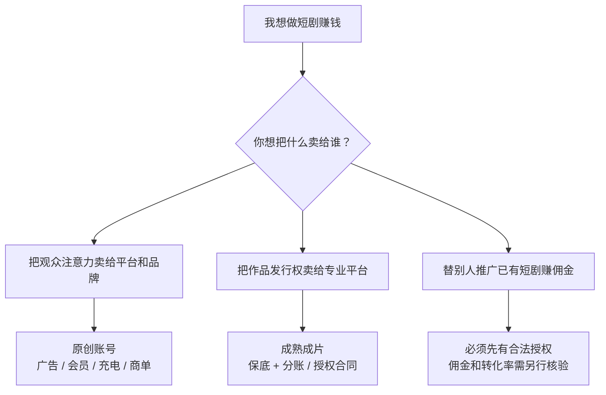

# 先看结论：这件事到底值不值得做

## 一句话答案

短剧可以做，也确实存在收入渠道；但它更像一个小型内容生意，不是一个“下载工具、批量生成、自动收钱”的副业。

对个人来说，最大的错误不是拍得不够专业，而是**没有先分清自己靠什么赚钱**。

## “做短剧赚钱”其实是三门不同的生意

三条路不能混着讲：

| 路线 | 你真正要做的事 | 收钱之前先要有什么 |
|---|---|---|
| 原创账号 | 持续做观众愿意看的原创故事 | 内容能力、观众、平台资格 |
| 专业发行 | 做出达到平台要求的完整作品 | 样片、权利、合同谈判能力 |
| 授权推广 | 获得授权后剪辑和分发，为指定产品拉新 | 可核验授权、结算规则、转化渠道 |

网上大量“做短剧赚钱”的视频把这三件事揉成一句话，于是看上去人人都能做，实际上门槛、风险和收入方式完全不同。

## 已经能够确认的事

### 做短剧不是只写一个故事

通用短片制作至少需要剧本、拍摄计划和预算；进入执行前，还要完成剧本拆分、分镜或镜头清单、排期、演员与团队、场地等工作。AI 可以替换一部分工具，但不能自动消除这些决定。

来源：[StudioBinder 短片前期制作指南](https://www.studiobinder.com/blog/making-short-film-pre-production/)

### YouTube 有明确的收入渠道，但先有门槛

完整广告分成通常要求 1,000 订阅，并满足 4,000 小时公开观看时长或 90 天内 1,000 万有效 Shorts 公开观看。达到数字门槛后仍要通过频道审核。观看页广告、Shorts 和粉丝资助的分成规则也不相同。

来源：[YouTube Partner Program 资格说明](https://support.google.com/youtube/answer/72851)、[YouTube 收益说明](https://support.google.com/youtube/answer/72902)

### B站也有收入渠道，但“能开通”和“赚得到”是两件事

B站充电允许观众直接支持 UP 主；花火商单平台当前要求实名认证、年满 18 岁、至少 1 万粉丝、近 30 天发过原创视频，并达到相应分数。符合入驻条件不等于一定有商单。

来源：[B站充电计划协议](https://www.bilibili.com/blackboard/charge-privacy.html)、[花火入驻 FAQ](https://www.bilibili.com/blackboard/activity-zWUGlzmXPK.html)

### 专业发行是另一条路

DramaBox 日本创作者页面接受 15—100 集的短剧洽谈，基本收益结构写为 MG（最低保底）加收入分成，但样片需要经过内容确认、合同和技术检查；具体比例、费用、独占性都要看合同。

来源：[DramaBox 创作者页面](https://www.dramabox.jp/creators)

### 中国境内上线还要处理审核与备案

国家广播电视总局文件要求，相关平台、小程序和投流方传播的微短剧须持有发行许可证或完成上线报备；新的《微短剧发展管理办法》已公布，将于 2026-09-01 施行。本案例检索时该日期尚未到。

来源：[国家广播电视总局 2025 年公开通知](https://www.nrta.gov.cn/art/2025/2/5/art_113_70148.html)、[《微短剧发展管理办法》](https://www.nrta.gov.cn/art/2026/7/31/art_1588_73827.html)

## 目前不能确认的事

我们没有找到足以支持下列结论的独立数据：

- 普通人学完一套 AI 短剧教程就能接到订单；
- 新手做短剧推广可以稳定月入 2 万；
- 每天投入一小时就能普遍月赚 2,300 元以上；
- 某个题材、时长或 AI 工作流必然更赚钱；
- 向专业平台提交样片就能获得保底合同。

这些内容不是被证明“绝对错误”，而是**证据不够，不能拿来做预算、辞职或付费决策**。

## 对个人用户最实际的建议

先不要问“短剧能赚多少钱”，先用一部 3 集样片回答三个更小的问题：

1. 我能不能按预算把它做完？
2. 陌生观众愿不愿意看完并继续看下一集？
3. 我选的收入路径，距离真实门槛还有多远？

如果这三个问题没有答案，做 100 集只会把不确定性放大 30 多倍。
