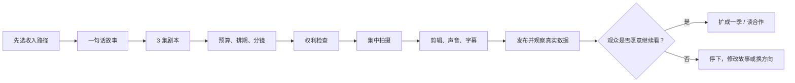

# 怎么做出一部短剧

这不是“唯一正确的拍法”，而是一条适合个人或小团队的低风险流程。来源支持的制作基础与本案例给出的执行建议会分开标记。

## 整体流程

## 第 1 步：先选收入路径

在写剧本前先回答：

- 这是给自己的 B站或 YouTube 账号积累观众？
- 这是准备卖给短剧分发平台的样片？
- 还是为一个已经获得授权的项目做推广？

这一步是本案例的**策略建议**。因为不同路径会改变集数、画幅、节奏、权利和交付格式。

## 第 2 步：把故事缩成一句话

建议用这个句式：

> 一个怎样的人，为了什么目标，必须克服什么阻碍；失败会失去什么？

案例：

> 一个能听见别人谎言的外卖员，必须在三次送餐内找出绑走妹妹的人；但他每拆穿一次谎言，就会失去一段关于妹妹的记忆。

这句话不是知识结论，而是帮助创作者检查故事是否有“人物、目标、阻碍和代价”的实用模板。

## 第 3 步：先写 3 集，不要先写 100 集

一个可验证的 3 集结构：

| 集数 | 任务 | 示例 |
|---|---|---|
| 第 1 集 | 让观众理解异常规则，并留下必须继续看的问题 | 外卖员第一次听见谎言，发现订单地址与妹妹失踪有关 |
| 第 2 集 | 让主角尝试解决，但代价变大 | 他拆穿嫌疑人，却忘了妹妹的声音 |
| 第 3 集 | 给出阶段答案，同时制造更大的选择 | 他找到绑匪，却发现真正说谎的是妹妹 |

先做 3 集是本案例的**成本控制建议**，不是平台规定。

## 第 4 步：准备三份基础文件

权威制作指南支持的基础文件是：

1. 剧本：拍什么、谁说什么；
2. 拍摄计划：哪一天、什么地点、谁参与；
3. 预算：钱花在哪里，超支上限是什么。

来源：[StudioBinder 短片前期制作指南](https://www.studiobinder.com/blog/making-short-film-pre-production/)

个人项目可以把它们压缩成一张表，但不能完全没有。

| 场景 | 镜头 | 演员 | 地点 | 道具 | 预计耗时 | 成本 | 权利状态 |
|---|---|---|---|---|---:|---:|---|
| 外卖员到门口 | 中景跟拍 | A | 朋友家门口 | 外卖箱 | 30 分钟 | 0 | 场地已同意 |
| 手机出现匿名消息 | 手机特写 | 无 | 同上 | 手机界面 | 15 分钟 | 0 | 自制界面 |
| 回忆中的妹妹 | 固定近景 | B | 白墙 | 旧照片 | 40 分钟 | 100 元 | 演员授权待签 |

B站一篇实务文章把画面、运镜、景别、时长、台词、声音、转场和道具列为拍摄脚本字段。这个模板可以参考，但不是唯一格式。

来源：[B站分镜脚本文章](https://www.bilibili.com/opus/602498179786822057)

## 第 5 步：拍摄前先做权利检查

至少检查：

- 剧本是否原创或已获得改编权；
- 演员的肖像、声音和表演是否允许发布和商业使用；
- 音乐、字体、图片、素材、场地是否允许使用；
- AI 生成素材的工具条款和训练来源是否满足你的用途；
- 给中国境内平台的微短剧，谁负责审核、备案和编号。

B站充电协议明确要求 UP 主拥有发布内容的合法权利或全部合法授权。[查看协议](https://www.bilibili.com/blackboard/charge-privacy.html)

## 第 6 步：真人拍摄和 AI 制作都要过同一张质量表

AI 教程通常把流程写成“剧本—分镜—角色—视频—配音—剪辑”。这可以视为一个待测试的工具链，但“学完即可接单”没有被本案例采信。

无论使用真人还是 AI，交付前都检查：

- 人物外观、声音和关系是否前后一致；
- 每个镜头是否服务故事，而不是只展示技术；
- 对话能否听清，字幕是否准确；
- 是否存在明显重复模板；
- 第一集是否留下清楚的问题；
- 下一集是否真的回答或推进了这个问题。

YouTube 要求变现内容保持原创和真实，不允许批量、重复、低差异内容靠模板规模化生产。[查看频道变现政策](https://support.google.com/youtube/answer/1311392)

## 第 7 步：发布的目的不是庆祝完成，而是获得证据

至少记录：

- 单集制作成本和工时；
- 观众看到哪里离开；
- 看完第 1 集的人，有多少继续看第 2 集；
- 评论是在讨论剧情，还是只在讨论 AI 画面；
- 新观众来自哪里；
- 有没有人愿意关注、充电、咨询合作或观看下一集。

这些指标的目标不是证明你“成功了”，而是决定下一步应该扩写、重拍、换题，还是停止。
