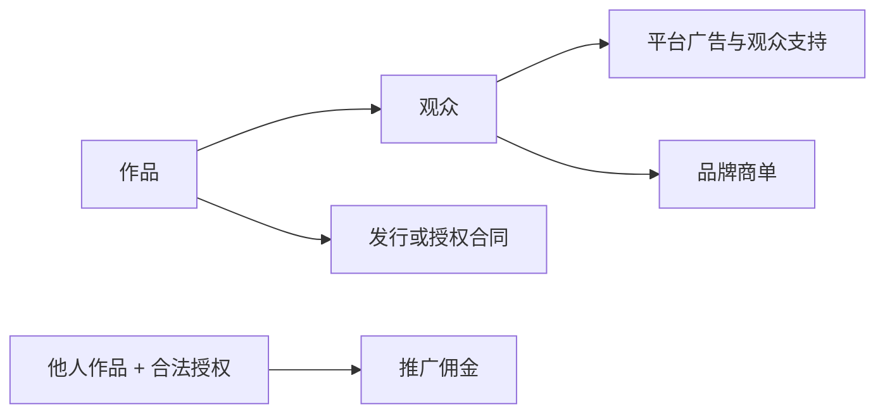
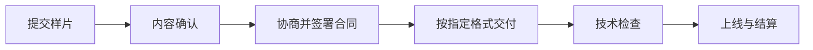

# 短剧到底靠什么赚钱

## 先把一句话说透

“短剧赚钱”不是一个收入模式，而是四个阶段完全不同的收入模式：

没有观众时，平台广告和商单很远；没有完整成片与权利时，发行合同很远；没有授权时，推广佣金可能直接变成侵权风险。

## 四条收入路线对比

| 路线 | 钱从哪里来 | 已确认的门槛 | 最大的不确定性 | 更适合谁 |
|---|---|---|---|---|
| YouTube 平台收入 | 广告、Premium、会员、Supers 等 | 完整广告分成通常要 1,000 订阅 + 4,000 小时，或 1,000 订阅 + 1,000 万 Shorts 有效观看；仍需审核 | 播放单价、地区、留存和审核结果 | 能持续做原创系列的人 |
| B站观众与商单 | 充电、花火商单 | 充电需按平台流程；花火当前要求 1 万粉丝、近期原创视频及相应分数 | 付费意愿、商单数量和报价 | 有稳定中文观众的 UP 主 |
| 专业短剧发行 | 保底、分账、授权 | DramaBox 日本页面接受 15—100 集；先交样片，再谈合同和技术检查 | 签约率、费用、分成、回款和独占范围 | 已有成熟成片和权利文件的团队 |
| 授权推广 | 为指定应用拉新获得佣金 | B站教程发布者称需先获得授权 | 真实佣金、结算、转化率、账号风险 | 已拿到可核验授权和结算后台的人 |

## 路线一：经营自己的 YouTube 短剧账号

### 已确认

- 完整广告分成门槛通常为 1,000 订阅，加 4,000 小时有效公开观看时长；或 1,000 订阅，加 90 天内 1,000 万有效 Shorts 公开观看；
- 达到门槛之后仍会审核频道；
- 观看页广告净收入分成为 55%；
- Shorts 采用 Creator Pool 分配机制，创作者获得分配后收入的 45%；
- 粉丝资助净收入分成为 70%；
- 批量、重复、低差异内容不符合变现要求。

来源：[YPP 资格](https://support.google.com/youtube/answer/72851)、[合作伙伴收益](https://support.google.com/youtube/answer/72902)、[Shorts 收益机制](https://support.google.com/youtube/answer/12504220)、[频道变现政策](https://support.google.com/youtube/answer/1311392)

### 不能由这些规则推出

- 1,000 万播放会固定赚多少钱；
- 达标后一定通过审核；
- AI 短剧一定不能变现；
- 正确披露 AI 后就一定可以变现。

YouTube 的规则是：逼真或经过实质性修改的 AI 内容需要披露；正确披露本身不会降低变现资格，但内容仍要满足其他政策。[查看 AI 披露规则](https://support.google.com/youtube/answer/14328491)

## 路线二：经营自己的 B站短剧账号

### 观众支持

B站充电计划允许用户通过充电面板支持 UP 主。它证明“有这条收入通道”，不证明观众一定愿意付费。

来源：[B站充电计划协议](https://www.bilibili.com/blackboard/charge-privacy.html)

### 品牌商单

B站花火当前列出的个人 UP 主入驻条件包括：

- 已实名认证且年满 18 岁；
- 粉丝不少于 1 万；
- 最近 30 天发布过原创视频；
- 创作分、影响分和信用分达到相应门槛。

来源：[花火入驻 FAQ](https://www.bilibili.com/blackboard/activity-zWUGlzmXPK.html)

这意味着个人新账号不能把“接商单”当第一个月的现金流计划。先有可持续内容和观众，商单才可能出现。

## 路线三：把成片交给专业平台发行

DramaBox 日本创作者页面展示了一条可以核验的专业发行路径：

该页面称：

- 接受 15—100 集的短剧洽谈；
- 基本收益结构为 MG（最低保底）加收入分成；
- 分成比例和条件以合同为准；
- 可能发生发行或准备费用；
- 原则上可在其他平台发行，但独占安排需单独协商。

来源：[DramaBox 创作者页面](https://www.dramabox.jp/creators)

因此，“有保底加分账”是平台页面支持的事实；“我的作品一定拿到保底”不是。

## 路线四：拿授权做短剧推广

B站一位教程发布者把这条路径描述为：取得授权，重新剪辑片段并发布，为指定应用拉新，按结果赚佣金。[查看视频页面](https://www.bilibili.com/video/BV1QryeBtEGv/)

本案例只把它保留为**创作者对模式的描述**，没有把它升级为确定的赚钱方法，原因是没有独立核验：

- 授权方是谁，授权范围是什么；
- 按下载、注册、充值还是其他动作结算；
- 佣金比例和结算周期；
- 退款、作弊判定和账号封禁规则；
- 新手真实的转化率与失败率。

如果对方不能提供可核验合同、授权链和真实后台，就不应该因为几张收益截图付费。

## 个人应该先选哪条

| 你现在拥有什么 | 优先验证 |
|---|---|
| 只有时间和一个故事 | 先做原创 3 集样片，验证能否持续生产和吸引观众 |
| 已有稳定观众 | 研究平台收入、充电和商单，不要只看播放量 |
| 已有 15 集以上成熟成片和完整权利 | 向专业发行平台询价并比较合同 |
| 只有一个“授权推广项目”的微信群或课程 | 先验证授权、结算主体和失败样本，未核验前不付费 |

最重要的不是选择“收入最高”的路线，而是选择**你当前真的具备前置条件**的路线。
