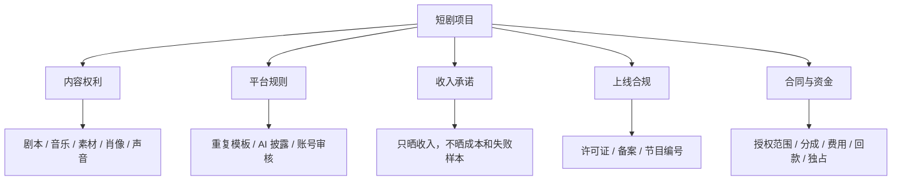
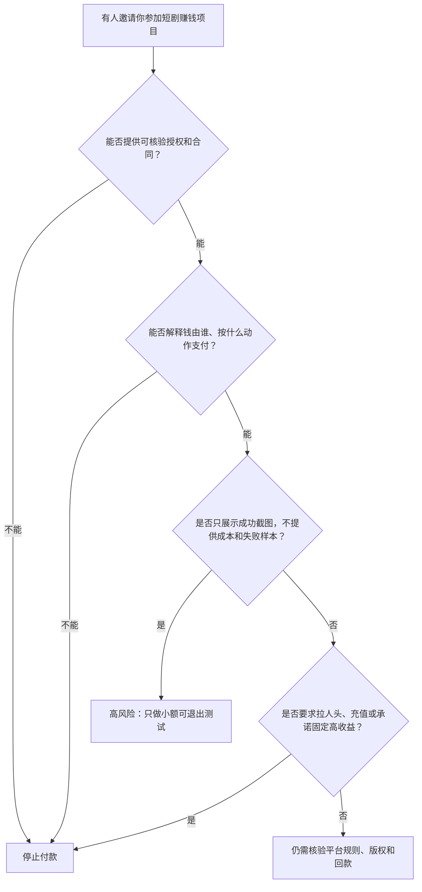

# 最容易踩的坑和骗局

## 风险地图

## 坑一：把别人的短剧剪一剪就去变现

“网上能下载”不等于“允许商用”，“经过二次剪辑”也不会自动获得版权。

B站充电计划协议要求 UP 主拥有发布内容的合法权利或全部合法授权。因此，“不需要版权也能剪他人短剧获利”被本案例直接排除。

来源：[B站充电计划协议](https://www.bilibili.com/blackboard/charge-privacy.html)

行动检查：

- 授权主体是否真的拥有这部剧的权利；
- 授权是否允许你所在的平台、地区、账号和商业用途；
- 是否允许再剪辑、加字幕、投流；
- 音乐、演员肖像等权利是否包含在内；
- 授权和结算是否写进合同。

## 坑二：把“有人赚到”理解成“我也能赚到”

本案例找到的典型主张包括：

- “这个月多赚 2300+”；
- “小白也可以月入 2w+”；
- “零基础学完即可接单变现”。

问题不在于这些话必然是假的，而在于它们通常缺少：

- 收入后台原始记录；
- 制作、投流、课程、账号和人工成本；
- 失败账号的数量；
- 原有粉丝和资源；
- 退款、封号与不可结算金额；
- 可重复的样本。

所以，收入自述只能证明“发布者这样说过”，不能证明典型用户收益。

相关页面：[月赚 2300+ 自述](https://www.bilibili.com/video/BV1NahvzTEYn/)、[月入 2w+ 主张](https://www.bilibili.com/video/BV1Wr421H7oz/)、[AI 短剧课程主张](https://www.bilibili.com/video/BV1n3Vz6LEVS/)

## 坑三：把 AI 当成批量复制许可证

使用 AI 本身不等于不能变现。真正的风险是内容批量、重复、低差异，或者逼真生成内容未按要求披露。

YouTube 官方规则明确：

- 批量生产或重复内容不符合频道变现要求；
- 逼真或经过实质性修改的生成内容需要披露；
- 正确披露本身不限制变现资格，但其他规则仍然适用。

来源：[YouTube 频道变现政策](https://support.google.com/youtube/answer/1311392)、[AI 内容披露](https://support.google.com/youtube/answer/14328491)

因此，“一套模板批量生成就能稳定过审”被本案例排除；“AI 一律不能赚钱”也不是官方规则支持的结论。

## 坑四：拍完才发现不能上线

中国境内网络微短剧存在分类分层审核、许可和备案要求。国家广播电视总局公开通知要求，相关平台、小程序和投流方传播的微短剧须持有发行许可证或完成相应上线报备；平台上线前还要标注相应号码。

来源：[国家广播电视总局公开通知](https://www.nrta.gov.cn/art/2025/2/5/art_113_70148.html)

新的《微短剧发展管理办法》将于 2026-09-01 施行，规定未取得发行许可证、批准文件或节目编号的微短剧不得播出。本案例检索日为 2026-08-21，实际项目应在上线前重新核对最新规则。

来源：[《微短剧发展管理办法》](https://www.nrta.gov.cn/art/2026/7/31/art_1588_73827.html)

## 坑五：只看“保底 + 分账”，不看合同里的费用和权利

专业平台写着 MG 加分账，并不等于每个项目都有同样保底。DramaBox 日本创作者页面同时说明：分成以合同为准，可能发生发行或准备费用，是否独占也要协商。

来源：[DramaBox 创作者页面](https://www.dramabox.jp/creators)

签约前至少问清：

- MG 是签约即付、上线后付，还是达到条件后付；
- 哪些费用先从收入里扣；
- 分账按流水、净收入还是其他口径；
- 结算周期、税费和最低付款额；
- 授权地区、语言、期限、平台和改编权；
- 是否独占，提前解约怎么办；
- 平台是否有推广义务，还是只有上线义务。

## 一个简单的骗局判断器

B站有发布者提醒短剧版权剪辑、分红和投资项目中存在骗局风险。本案例只把它作为风险提醒，不能据此认定某个具体项目违法或诈骗。[查看提醒视频](https://www.bilibili.com/video/BV1rwdjBHEdE/)
