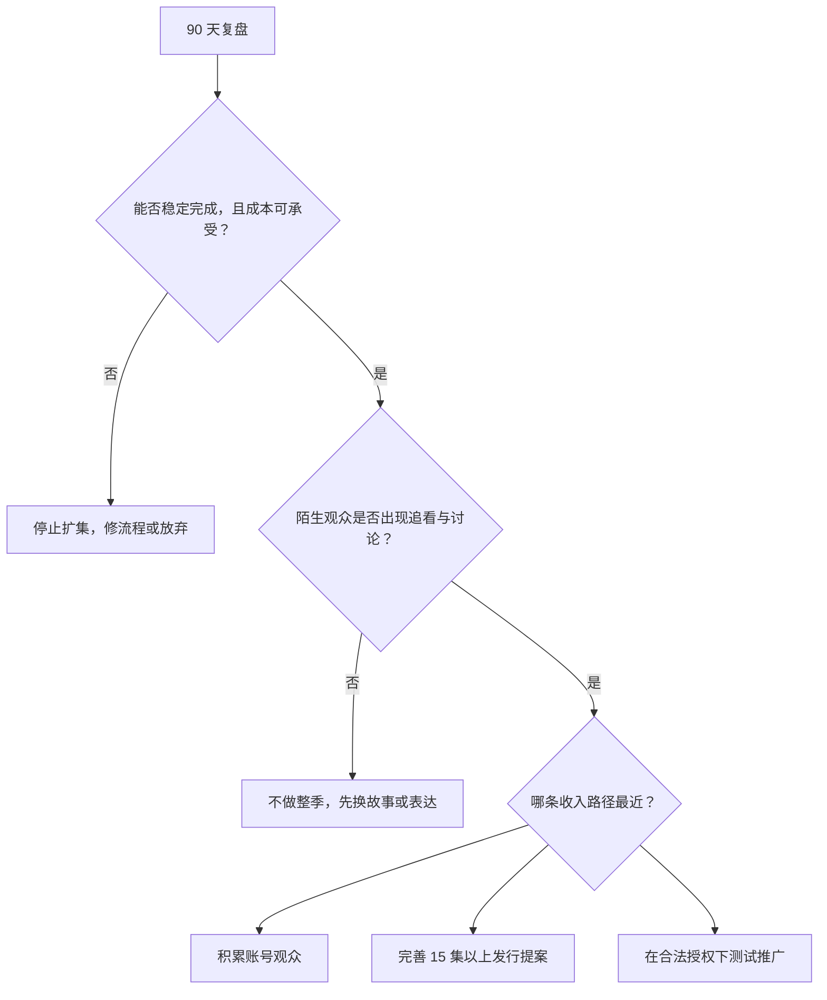

# 一个人也能执行的 90 天验证方案

> 这是根据已确认的制作基础、平台门槛和风险边界提出的行动建议，不是来源直接给出的赚钱公式，也不保证收益。

## 案例设定

小林有一份全职工作，周末可以投入 8—10 小时，手里有手机、电脑和两位愿意帮忙的朋友。他想验证：自己能否做原创短剧，并逐渐形成收入。

约束：

- 首轮现金预算上限：3,000 元；
- 先做 3 集，每集 60—90 秒；
- 1 个主要场地，2 位主要演员；
- 不购买“包变现”课程，不使用无授权影视素材；
- 90 天的目标是取得继续或停止的证据，不是赚回工资。

## 成功不是“爆了”，而是回答四个问题

1. 能不能在预算和时间内稳定完成？
2. 陌生观众是否愿意看完、讨论故事并继续追下一集？
3. 每完成一集，成本和工时是否下降而质量没有明显变差？
4. 距离选定收入路径的真实门槛还有多远？

## 第 1—14 天：把风险关在纸上

交付物：

- 一句话故事；
- 3 集剧本；
- 一张拍摄计划；
- 一张预算表；
- 一张镜头清单；
- 一张权利清单；
- 选定一个主平台和一个收入路径。

预算建议：

| 项目 | 上限 |
|---|---:|
| 演员交通和餐食 | 800 元 |
| 场地与道具 | 500 元 |
| 收音或灯光补充 | 800 元 |
| 音乐、字体、素材授权 | 300 元 |
| 备用金 | 600 元 |
| 合计 | 3,000 元 |

停止条件：剧本需要 5 个以上场地、核心素材权利说不清、预算已经超过上限，先缩故事，不开拍。

## 第 15—30 天：集中完成 3 集样片

工作顺序：

不要在这一步追求“电影级”。先保证：故事看得懂、声音听得清、人物前后一致、每集结尾有真实推进。

记录实际数据：

| 指标 | 计划 | 实际 |
|---|---:|---:|
| 总现金成本 | ≤ 3,000 元 |  |
| 总工时 | ≤ 60 小时 |  |
| 拍摄天数 | 1—2 天 |  |
| 完成集数 | 3 集 |  |
| 无授权素材数 | 0 |  |

## 第 31—60 天：把样片放到陌生人面前

发布时不要一次性把所有变量都改掉。至少保留：

- 每集版本和发布时间；
- 标题、封面、简介；
- 播放、平均观看时长、完播或留存；
- 第 1 集到第 2 集的追看情况；
- 新增关注；
- 讨论剧情的评论数；
- 充电、合作咨询等真实收入信号。

本案例不规定“完播率达到多少就是成功”，因为没有足够可靠的跨平台、跨题材基准。你要比较的是自己的三集和后续版本，而不是套用陌生账号的截图。

## 第 61—75 天：只改一个最关键问题

根据数据选择一种修改：

- 开头看不懂：重写前 5—10 秒的信息；
- 第一集有人看完但没人追第二集：加强集尾问题和下一集承接；
- 评论只讨论 AI 瑕疵：降低工具炫技，优先修人物与故事一致性；
- 制作成本失控：减少场景、演员和不可控镜头；
- 有观看但没有关注：检查系列承诺是否清楚。

重新制作一个版本或追加 1 集，不要同时更换题材、账号、风格、时长和平台，否则无法知道什么起作用。

## 第 76—90 天：作出继续、转向或停止决定

### 继续

当你能稳定完成、成本可控，并出现真实追看或合作信号时，才考虑扩为 6—15 集。

### 转向

制作能力没问题，但故事没有追看时，保留流程，换故事；不要用投流把一个未经验证的故事硬推成“项目”。

### 停止

如果成本持续超支、权利无法理清、自己也无法稳定投入，停止不是失败，而是用 3,000 元避免了一个更大的错误。

## 90 天以后如何接收入路线

| 已出现的证据 | 下一步 |
|---|---|
| 观众持续增长 | 继续原创账号，逐步接近 YouTube YPP 或 B站受众变现条件 |
| 中文观众愿意支持 | 研究 B站充电；达到条件后再看花火商单 |
| 3 集样片获得专业反馈，且能扩到 15 集以上 | 准备完整权利、预算和样片，向分发平台询价 |
| 有明确授权方和可核验结算 | 小规模测试推广，记录净收益而不是只看佣金流水 |
| 只有课程销售人员催促付款 | 不把它当业务信号 |

这套方案最重要的成果不是一部短剧，而是四项可以复用的资产：制作流程、原创权利、真实观众数据和成本记录。即使第一部没有赚钱，下一次判断也不再靠想象。
