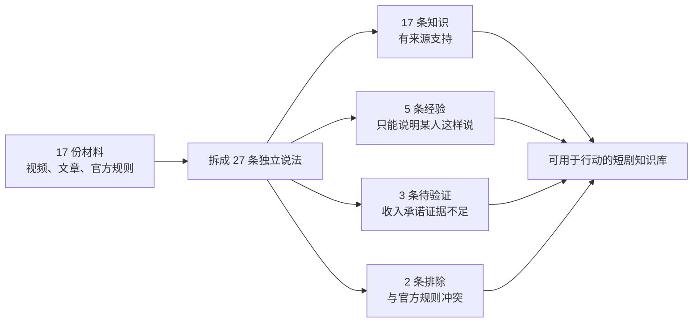
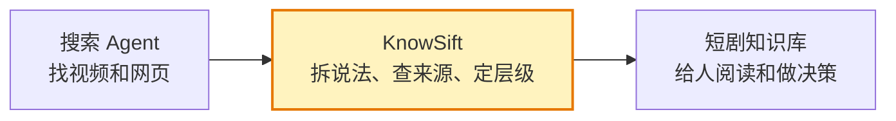

# 短剧怎么做、怎么赚钱？

> 一个真实检索、真实筛选的 KnowSift 标杆案例。

我们向 Bilibili、YouTube 和相关官方页面提出了一个普通人真的会问的问题：

> 我想做短剧，也想靠它赚钱。网上这么多教程，哪些能信？我该怎么开始？

结果不是又一篇“七天起号、月入两万”的教程，而是一套能看出**事实、经验、广告话术和风险**的知识库。

## 30 秒看懂结果

| 网上常见说法 | 过滤后的结论 |
|---|---|
| “学完 AI 短剧教程即可接单” | 只有课程营销页，没有订单、报价、失败率，不能当知识 |
| “新手做短剧推广能稳定月入 2 万” | 收入承诺缺少可审计数据，暂不采信 |
| “每天一小时，这个月多赚 2300+” | 可以确认发布者这样自述，不能推导普通人也能做到 |
| “直接剪别人的短剧就能赚钱” | 排除；B站变现规则要求拥有权利或完整授权 |
| “AI 批量生成，稳定通过 YouTube 变现” | 排除；YouTube 不允许批量、重复、低差异内容变现 |
| “原创短剧可以通过平台分成、观众支持、商单或发行合同赚钱” | 可以，但每条路有不同门槛，而且没有一条保证赚钱 |

这就是这个 Skill 的价值：**它不替你制造信心，它替你避免把广告当方法、把个案当规律、把播放量当利润。**

## 这次到底找了什么

共收录 17 份材料：

- 5 个 B站短剧制作、推广、收入和骗局相关页面；
- 1 个 YouTube 独立电影创作者视频；
- 4 份 YouTube 官方变现与 AI 内容规则；
- 2 份 B站官方变现规则；
- 2 份国家广播电视总局文件；
- 1 份短片前期制作指南；
- 1 份专业短剧分发平台的创作者说明；
- 1 篇 B站分镜实务文章。

视频没有完整字幕时，本案例只记录标题、简介或发布者明确作出的主张，不擅自补写视频内容。检索时间为 2026-08-21。

## 给普通人的直接答案

如果你第一次做短剧，最合理的起点不是先买课，也不是剪别人作品赚佣金，而是：

1. 选定一条收入路径，再决定拍什么；
2. 用原创、低成本的 3 集样片验证自己能不能持续做出有人愿意看完的故事；
3. 保留剧本、预算、拍摄计划、素材权利和后台数据；
4. 有观众后再谈平台分成、充电、商单；
5. 有成熟成片后再向专业平台询价、谈发行合同；
6. 没有授权，不剪他人短剧获利；没有后台数据，不相信收益截图和口头承诺。

这是一条**低成本验证路径**，不是收益保证。完整做法见 [90 天验证方案](05-90天验证方案.md)。

## 从这里开始看

- [先看结论：这件事到底值不值得做](01-先看结论.md)
- [怎么做出一部短剧](02-怎么做短剧.md)
- [短剧到底靠什么赚钱](03-怎么赚钱.md)
- [最容易踩的坑和骗局](04-风险与骗局.md)
- [一个人也能执行的 90 天验证方案](05-90天验证方案.md)
- [27 条说法的完整审计表](CLAIM-AUDIT.md)
- [机器生成的分层知识文档](RESULT.md)
- [17 份来源的原始记录](source-bundle.json)
- [每条说法的准入证书](certificates/)

## Skill 嵌在什么位置

它不负责替代 B站、YouTube 搜索，也不负责替你拍片。它只负责搜索之后最容易出问题的一步：**决定哪些东西配叫“知识”。**

## 这个案例证明了什么，也没有证明什么

它证明了：

- Skill 能把混在一起的视频经验、平台规则、收入承诺拆开；
- 最终知识文档不会把暂缓或否定的说法偷偷写成结论；
- 每条结论都能回到原来源和单独证书；
- 同一批材料可以进一步变成行动手册，而不丢掉证据边界。

它没有证明：

- 做短剧一定能赚钱；
- 本案例列出的平台是全部平台；
- 某种题材、时长或 AI 工具一定更有效；
- 90 天方案适合所有预算和地区。

真正仍然缺失的数据，是独立创作者的真实成本分布、签约率、回本率、各题材留存率以及失败样本。这些问题被明确保留在知识库里，没有用“行业都这么做”糊过去。
